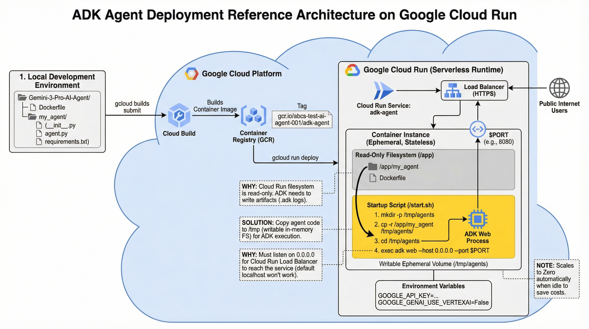

# ADK Agent with Google Search & Gemini 3

This project demonstrates how to build a single AI agent powered by the **Gemini 3** model using the **Google Agent Development Kit (ADK)**. The agent is equipped with the **Google Search Tool**, enabling it to access real-time information from the web. The application includes a local web interface and is designed for seamless deployment to **Google Cloud Run**.



📺 **This project was inspired Smitha Kolan's tutorial:** [Build an AI Agent with Gemini 3](https://youtu.be/9EGtawwvlNs)

## 📚 Resources & References

*   **Original GitHub Repository:** [https://goo.gle/4pq0pep](https://goo.gle/4pq0pep)
*   **Getting Started with uv:** [https://goo.gle/4a7M7KG](https://goo.gle/4a7M7KG)
*   **ADK Google Search Tool Documentation:** [https://goo.gle/3LGFKUR](https://goo.gle/3LGFKUR)
*   **Deployment Guide:** [adk-agent-deployment-guide-for-google-cloud-run.md](adk-agent-deployment-guide-for-google-cloud-run.md)

## 🚀 Getting Started

Follow these steps to set up your environment and run the agent.

### Prerequisites

1.  **uv**: An extremely fast Python package installer.
2.  **Google Cloud Project**: With the Gemini API enabled.
3.  **GOOGLE_API_KEY**: A valid API key from [AI Studio](https://aistudio.google.com).

### Installation & Execution

1.  **Initialize Project & Install Dependencies:**
    ```bash
    uv init
    uv add google-adk google-genai
    ```

2.  **Configure Environment:**
    Set your Google API key.
    ```bash
    export GOOGLE_API_KEY="YOUR_API_KEY"
    # On Windows PowerShell: $env:GOOGLE_API_KEY="YOUR_API_KEY"
    ```

3.  **Activate Virtual Environment:**
    ```bash
    source .venv/bin/activate
    # On Windows: .venv\Scripts\activate
    ```

4.  **Create Agent (if not already present):**
    ```bash
    adk create my_agent
    ```
    *Note: Select **Gemini 3** when prompted for the model.*

5.  **Run the Agent:**
    
    *   **Terminal Mode:**
        ```bash
        adk run my_agent
        ```

    *   **Web Interface:**
        ```bash
        adk web --port 8000
        ```
        Open your browser and navigate to `http://localhost:8000`.

## ☁️ Deployment

For detailed instructions on deploying this agent to **Google Cloud Run**, please refer to the included guide:
👉 [adk-agent-deployment-guide-for-google-cloud-run.md](adk-agent-deployment-guide-for-google-cloud-run.md)
